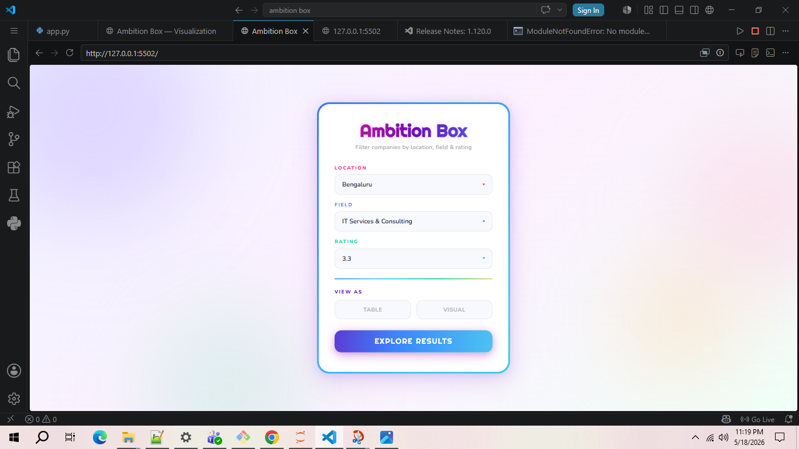
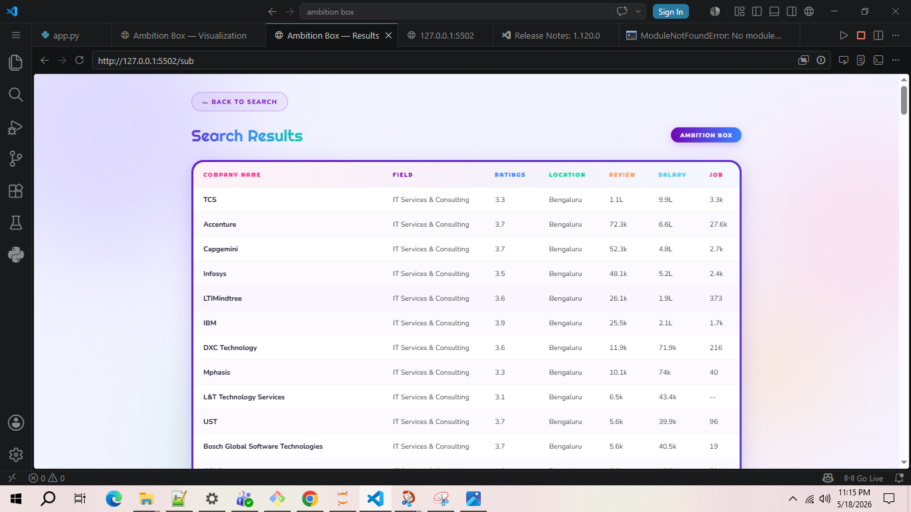
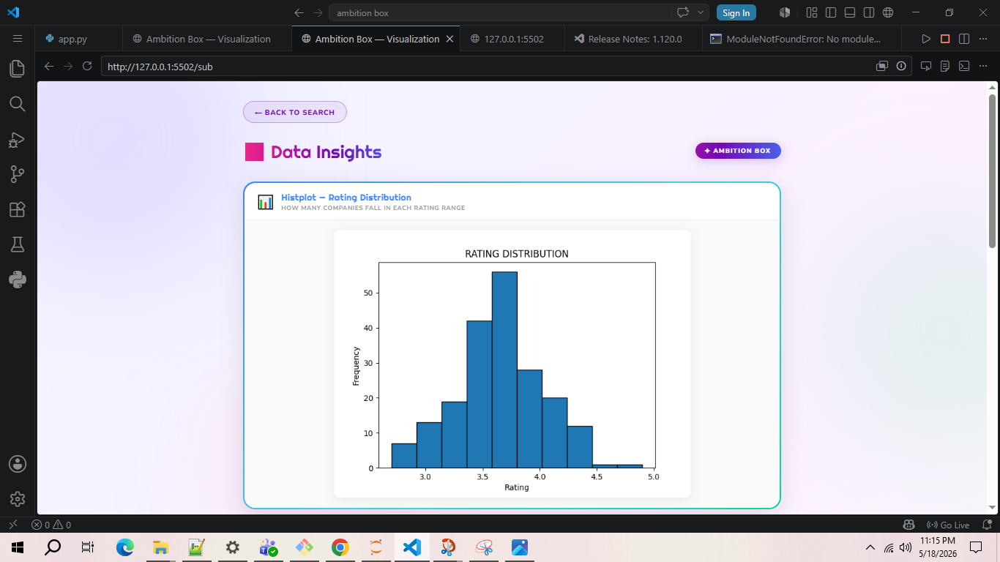
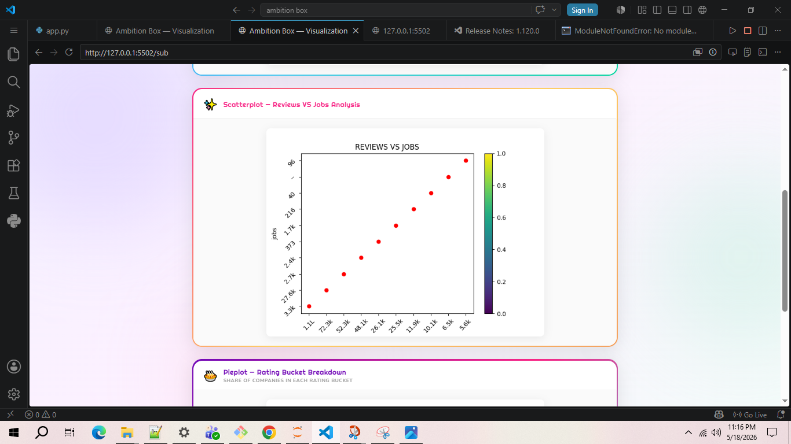
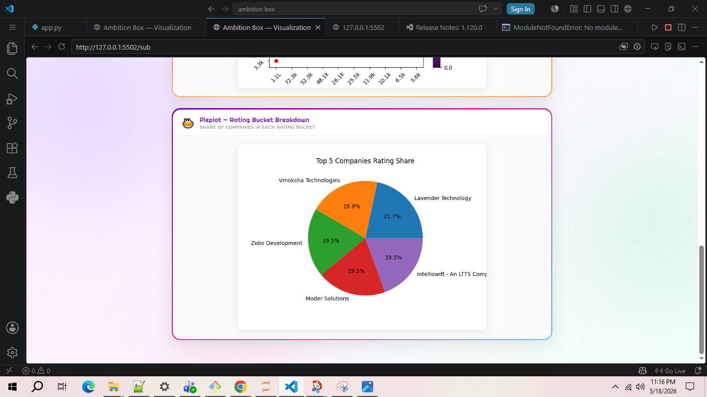

# AmbitionBox Job Data Scraper & Dashboard

A Python-based project where job/company data is scraped from AmbitionBox, cleaned using Pandas, stored in CSV format, and displayed through an interactive Flask web application.

---

# Project Overview

This project demonstrates the complete mini data pipeline:

- **Web Scraping** – Extracted data from AmbitionBox using Python.
- **Data Storage** – Saved scraped data into CSV format.
- **Data Processing** – Loaded and handled data using Pandas.
- **Web Application** – Built a Flask app to display the data in a clean and user-friendly way.

---

# Technologies Used

- Python
- Pandas
- Flask
- BeautifulSoup
- Requests
- CSV

---

# Features

✅ Scrapes data from AmbitionBox  
✅ Converts extracted data into CSV  
✅ Reads and processes CSV using Pandas  
✅ Displays data on a Flask web interface  
✅ Simple and clean project structure  

---

# Project Workflow

```text
AmbitionBox Website
        ↓
Web Scraping using Python
        ↓
Store Data in CSV
        ↓
Read & Process using Pandas
        ↓
Display using Flask App
```

---

# How to Run the Project

## Clone the repository

```bash
git clone <your-repo-link>
```

## Install required libraries

```bash
pip install -r requirements.txt
```

## Run the Flask app

```bash
python app.py
```

## Open browser and visit

```text
http://127.0.0.1:5000/
```

---

# Output

- Extracted company/job data from AmbitionBox
- Structured CSV dataset
- Flask-based UI for visualization

---

# Learning Outcomes

Through this project, I learned:

- Web scraping concepts
- Handling real-world data
- CSV operations using Pandas
- Building web applications with Flask
- Connecting backend data with frontend display

---

# Future Improvements

- Add search and filtering options
- Store data in a database
- Improve frontend UI
- Deploy the project online

---
## 📸 Screenshots

### Home Page


### Table


### Visualization



# Author

**Prachi Soni**
